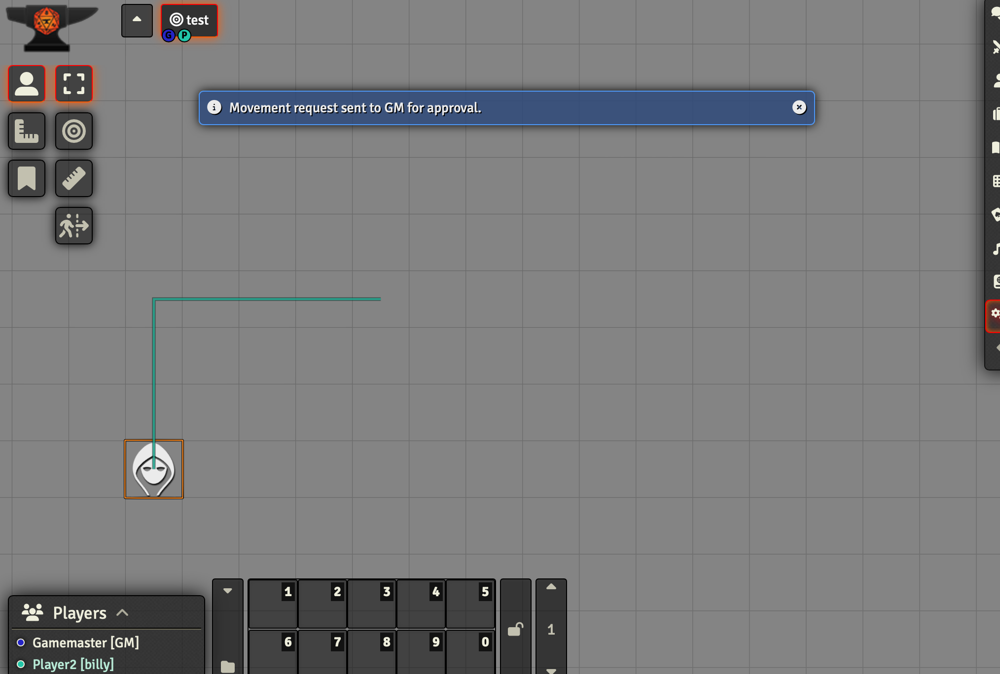
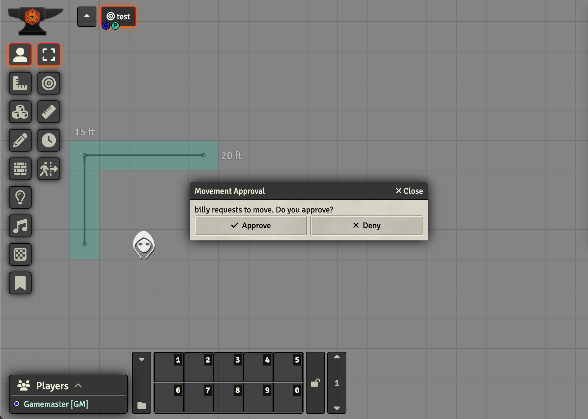
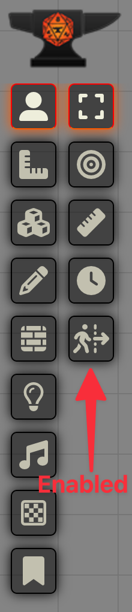
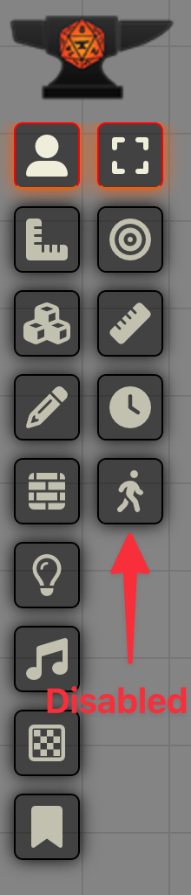

# Movement Approval

## Description

Movement Approval is a Foundry VTT module that adds a layer of control to token movement on the game board. It enables
a GM to toggle approval for player-initiated token movements, enhancing tactical gameplay and maintaining GM oversight.

What does the player see?

What does the GM see?

## Features

- GM can toggle approval for token movements approval initiated by players
- Displays visual paths for proposed movements
- Allows GMs to approve or deny movement requests
- Prevents unauthorized token dragging
- Provides clear notifications for players and GMs
- Supports cancellation of pending movement requests
- Handles disconnections gracefully

## Why Use Movement Approval?

1. **Enhanced Tactical Gameplay**: By requiring approval for movements, this module encourages more thoughtful and
   strategic play.

2. **GM Control**: GMs can maintain better control over the flow of combat and exploration, ensuring that movements
   align with the game's rules and narrative. This can be especially useful in complex combats or puzzles, or to prevent
   early reveals of the map when you're just not ready for that.

3. **Visual Feedback**: The module provides clear visual cues for proposed movements, making it easier for both players
   and GMs to understand the intended actions.

4. **Flexibility**: The module can be easily toggled on or off, allowing for its use only when needed.

5. **Improved Communication**: The approval process encourages more communication between players and the GM about
   character actions and intentions.

How does the control look like?

## Installation

1. Copy the module URL: [https://github.com/smeevil/foundryvtt-movement-approval/releases/latest/download/module.json](
2. In Foundry VTT, navigate to the "Add-on Modules" tab in the Configuration and Setup menu
3. Click "Install Module" and paste the URL
4. Click "Install" and wait for installation to complete
5. Activate the module in your World's Module Settings

## Usage

### For GMs:

- Toggle the module on/off using the lock icon in the token controls
- Approve or deny movement requests through the dialog that appears

### For Players:

- When the module is active, use the ruler tool to propose movements
- Wait for GM approval before the token moves
- Cancel pending requests if needed

## Configuration

The module doesn't require additional configuration beyond enabling/disabling it in the module settings.

## Support

If you encounter any issues or have suggestions for improvements, please file an issue on
the [GitHub repository](https://github.com/smeevil/foundryvtt-movement-approval).

## License

GPL-3.0 License. See the [LICENSE](LICENSE) file for details.

## Acknowledgements

Thanks to the Foundry VTT community for inspiration and support in creating this module.
